# 📦 Dynamic Reorder Point System

An **AI-powered inventory management system** that uses machine learning-based demand forecasting to calculate dynamic reorder points and identify when inventory needs to be replenished.

The system is designed to work with different inventory and sales datasets by automatically detecting important business columns such as product, demand, stock, price, lead time, category, and SKU.

---

## 🚀 Project Overview

Traditional inventory systems often use a fixed reorder point for every product.

However, demand can change because of:

- Seasonal patterns
- Historical sales
- Promotions
- Holidays
- Product demand variability
- Supplier lead time
- Inventory availability

This project uses **machine learning demand forecasting** and **dynamic safety stock calculation** to determine when inventory should be reordered.

## 🌐 Live Demo
https://dynamic-reorder-points-cvjkl7r35bexcfnk5kr8sa.streamlit.app/


### Basic Workflow

```text
Raw Inventory / Sales CSV
          ↓
Automatic Column Detection
          ↓
Data Quality Analysis
          ↓
Data Cleaning
          ↓
Feature Engineering
          ↓
Exploratory Data Analysis
          ↓
Demand Forecasting
          ↓
Dynamic Safety Stock
          ↓
Dynamic Reorder Point
          ↓
Inventory Status
          ↓
Reorder Recommendation
          ↓
Download Results

```


## 🎯 Objectives

The main objectives of this project are:

- Automatically detect important columns from different datasets.
- Analyze missing values and duplicate records.
- Clean and prepare raw inventory/sales data.
- Create time-series and demand-related features.
- Analyze historical demand patterns.
- Train multiple machine learning regression models.
- Select the best-performing demand forecasting model.
- Predict future demand.
- Calculate dynamic safety stock.
- Calculate dynamic reorder points.
- Identify inventory that requires reordering.
- Recommend the quantity that should be ordered.
- Provide an interactive Streamlit dashboard.
- Allow users to download the final reorder results.


## ✨ Key Features
1. 📁 CSV Upload

Users can upload an inventory or sales CSV file directly through the Streamlit interface.
```
Upload Inventory Dataset
        ↓
Automatic Processing
```
The system is designed to support different column naming conventions.

For example:
```
current_stock
stock_available
available_stock
inventory
stock
```
can represent the inventory/stock column.

Similarly:
```
units_sold
quantity_sold
sales_quantity
quantity
demand
sales
```
can represent demand.

## 2 🔎 Automatic Column Detection

The system automatically detects important business columns.

Supported column categories include:

- Date
- Product
- Demand
- Stock
- Lead Time
- Price
- Discount
- Promotion
- Holiday

Example:
```
date → Date
product → Product_Name
demand → Units_Sold
stock → Current_Stock
lead_time → Lead_Time_Days
price → Unit_Price
```
The detector also provides a confidence score for detected columns.

##  🧪 Data Quality Analysis

The system analyzes:

Total rows
Total columns
Missing values
Duplicate records
Numeric columns
Categorical columns
Category distribution

Example:
```
Rows           : 8,766
Columns        : 10
Missing Values : 0
Duplicates     : 0
```

## 4. 🧹 Data Cleaning

The data cleaning stage prepares the dataset for machine learning.

It handles:

- Duplicate rows
- Missing values
- Invalid numeric values
- Date conversion
- Numeric conversion
- Outliers
- Data consistency

The application displays a cleaning report containing information such as:
```
Rows before
Rows after
Duplicates removed
Missing values before
Missing values after
Outliers detected
```

## 5. ⚙️ Feature Engineering

The system creates time-series and demand-related features.

Date Features
```
year
month
day
day_of_week
week_of_year
is_weekend
```
Lag Features
```
lag_1_day
lag_7_days
lag_14_days
```
Rolling Features
```
rolling_7_day
rolling_30_day
rolling_7_day_std
```
Pricing Features
```
discount_amount
final_price
```

These features help the machine learning models identify historical demand patterns.

## 6. 📊 Exploratory Data Analysis

The system performs exploratory analysis of the inventory and demand data.

It provides:

Numerical Statistics
- Total demand
- Average demand
- Minimum demand
- Maximum demand
- Standard deviation
- Other statistical measurements

Demand Distribution

The application visualizes the distribution of demand.

Demand by Category

The system aggregates demand by product category to help understand which categories contribute the most demand.

## 7. 🤖 Machine Learning Demand Forecasting

The project trains multiple regression models for demand forecasting.

Currently supported models include:

Linear Regression
```
LinearRegression
```
Random Forest
```
RandomForestRegressor
```
HistGradientBoosting
```
HistGradientBoostingRegressor
```

The models are evaluated using:

- MAE
- RMSE
- MAPE


## 8. 📈 Model Evaluation

The project compares the models using multiple evaluation metrics.

MAE

Mean Absolute Error measures the average absolute difference between actual and predicted demand.

Lower MAE is better.

RMSE

Root Mean Squared Error gives more weight to larger prediction errors.

Lower RMSE is better.

MAPE

Mean Absolute Percentage Error measures prediction error as a percentage.

Lower MAPE is better.

The application selects the model with the lowest MAE.

Example:
```
MODEL COMPARISON


Model                    MAE      RMSE      MAPE (%)
Random Forest             ...
Linear Regression         ...
HistGradientBoosting      ...


Best Model: Random Forest
```

## 9. 📈 Demand Prediction

After model training, the selected model is used to predict demand.

The application displays:
```
Average Predicted Demand
Minimum Prediction
Maximum Prediction
Forecast Records
```
The predictions are stored in:
```
predicted_demand

```
## 10. 📐 Dynamic Safety Stock

Instead of using the same safety stock for every product, the system calculates safety stock dynamically based on:

Service level
Demand variability
Lead time

The application supports:
```
90% → Z = 1.28


95% → Z = 1.65


99% → Z = 2.33
```
The user can select the desired service level from the Streamlit sidebar.

Higher service levels provide more protection against stockouts but generally require more safety stock.


## 11. 📦 Dynamic Reorder Point

The system calculates the reorder point using predicted demand, lead time, and dynamic safety stock.

Conceptually:
```
Reorder Point
=
Expected Demand During Lead Time
+
Safety Stock
```
The system then compares the current inventory against the calculated reorder point.

## 12. 🚨 Reorder Status

Each inventory record receives one of two statuses:
```
REORDER REQUIRED
```
or
```
SUFFICIENT STOCK
```
If current stock falls below the calculated reorder point, the system recommends reordering.


## 13. 📦 Recommended Order Quantity

The system calculates the quantity required to bring inventory back to the calculated reorder point.

Conceptually:
```
Recommended Order Quantity
=
Reorder Point - Current Stock
```
If current stock is already sufficient:
```
Recommended Order Quantity = 0
```

## 14. 📊 Inventory Dashboard

The Streamlit dashboard displays important inventory KPIs.

Example:
```
Products
🚨 Reorder Required
✅ Sufficient Stock
📦 Total Units to Order
```
The dashboard also provides:

- Reorder alerts
- Product inventory status
- Category summary
- Demand predictions
- Dynamic reorder points


## 15. 🚨 Reorder Alerts

The application displays all inventory records that require replenishment.

The result can contain information such as:
```
Date
SKU
Product Name
Brand
Category
Subcategory
Current Stock
Predicted Demand
Lead Time
Dynamic Safety Stock
Dynamic Reorder Point
Reorder Status
Recommended Order Quantity
```
This makes the output useful for inventory and purchasing decisions.


## 16. 📊 Category Summary

The system summarizes inventory by category.

The category summary can include:
```
Category
Number of Products
Current Stock
Predicted Demand
Reorder Required
```
This provides a high-level overview of inventory requirements.


## 17. ⬇️ Download Results

Users can download the calculated reorder results as a CSV file.

Output file:
```
dynamic_reorder_results.csv
```
This allows the results to be used for:

- Purchasing
- Inventory planning
- Reporting
- Business analysis
- Further data processing


## 🗂️ Project Structure
```
Dynamic Reorder Points/
│
├── app.py
│
├── requirements.txt
├── README.md
│
├── data/
│   ├── raw/
│   └── processed/
│
├── models/
│   ├── model.pkl
│   └── preprocessor.pkl
│
├── notebooks/
│   ├── 01_data_analysis.ipynb
│   ├── 02_data_cleaning.ipynb
│   ├── 03_feature_engineering.ipynb
│   ├── 04_model_training.ipynb
│   └── 05_dynamic_reorder_point.ipynb
│
└── src/
    ├── __init__.py
    ├── data_detector.py
    ├── data_cleaner.py
    ├── feature_engineering.py
    ├── model_training.py
    ├── forecasting.py
    └── reorder_point.py

```    
## 🛠️ Technologies Used
Programming Language
- Python
Data Processing
- Pandas
- NumPy
Machine Learning
- Scikit-learn

Models:

- Linear Regression
- Random Forest Regressor
- HistGradientBoosting Regressor
  
Visualization
- Matplotlib
- Streamlit
  
Development
- Jupyter Notebook
- VS Code
- Git
- GitHub

  
📋 Example Dataset

The system can work with different inventory/sales dataset structures.

For example, a pharmacy dataset can contain:
```
date
sku
product_name
brand
category
subcategory
units_sold
unit_price
sales_revenue
stock_available
```
Example:
```
2022-01-20 | PH001 | Paracetamol 500mg | MediCare | Pain Relief | OTC Medicine | 45 | 523.91 | 23576.04 | 167
```
An electronics inventory dataset can contain:
```
Date
Product_ID
Product_Name
Category
Brand
Current_Stock
Units_Sold
Unit_Price
Discount_Percent
Promotion
Holiday
Lead_Time_Days
Safety_Stock
Stockout
```
The automatic column detection system allows the application to work with different naming conventions.

## 🔄 End-to-End Pipeline

The complete system works as follows:

Step 1 — Upload Dataset

User uploads a CSV file.

Step 2 — Detect Columns

The system identifies important business columns.

Step 3 — Analyze Data Quality

The system checks:
```
Missing Values
Duplicate Rows
Data Types
Category Distribution
```

Step 4 — Clean Data

The system removes duplicates and handles missing/invalid values.

Step 5 — Feature Engineering

The system creates:
```
Date Features
Lag Features
Rolling Features
Pricing Features
```
Step 6 — EDA

The system analyzes historical demand.

Step 7 — Train Models

Multiple regression models are trained.

Step 8 — Compare Models

The models are evaluated using:
```
MAE
RMSE
MAPE
```

Step 9 — Select Best Model

The model with the lowest MAE is selected.

Step 10 — Forecast Demand

The selected model predicts demand.

Step 11 — Calculate Safety Stock

Safety stock is dynamically calculated according to the selected service level.

Step 12 — Calculate Reorder Point

The system calculates the required reorder point.

Step 13 — Generate Reorder Status

Inventory is classified as:
```
REORDER REQUIRED
```
or
```
SUFFICIENT STOCK
```
Step 14 — Recommend Order Quantity

The system calculates how many units should be reordered.

Step 15 — Download Results

The final results can be downloaded as CSV.

## ⚙️ Installation
1. Clone the Repository

```
git clone https://github.com/MindRisers-Technologies/CRM-AI.git
```
Navigate to the project:
```
cd "Dynamic Reorder Points"
```

2. Create Virtual Environment

Windows:
```
python -m venv venv
```
Activate it:
```
venv\Scripts\activate
```

3. Install Dependencies
```
pip install -r requirements.txt
```
If you do not have a requirements file yet, install the main dependencies:
```
pip install pandas numpy scikit-learn streamlit matplotlib openpyxl
```

## ▶️ Running the Application

From the project directory:
```
streamlit run app.py
```
The application will open in your browser.

## 🧪 Testing

Individual modules can also be tested from the terminal.

For example:
```
python test_reorder_point.py
```
The test compares the demand forecasting models and calculates dynamic reorder points.

Example output:
```
MODEL COMPARISON


Model                    MAE       RMSE       MAPE (%)
HistGradientBoosting     ...
Linear Regression        ...
Random Forest             ...


Best Model: HistGradientBoosting
```
Then:
```
DYNAMIC REORDER POINT RESULTS
```
and:
```
INVENTORY SUMMARY
```

## 📊 Example Output

The system can generate results similar to:
```
Product Name       Current Stock    Predicted Demand
-----------------------------------------------------
Paracetamol 500mg       167              44.8
Antiseptic Liquid       109              25.0
```

After reorder-point calculation:
```
Product Name        Reorder Point     Status
------------------------------------------------
Paracetamol 500mg        273           REORDER REQUIRED
Antiseptic Liquid        174           REORDER REQUIRED
```

The application then calculates the recommended order quantity.

## 🎯 Business Benefits

The Dynamic Reorder Point System can help businesses:

- Reduce stockouts
- Improve inventory planning
- Avoid excessive inventory
- Automate reorder decisions
- Use historical demand for forecasting
- Adapt safety stock to demand variability
- Improve purchasing decisions
- Monitor inventory through an interactive dashboard

  
## 🧠 Machine Learning Approach

The project treats inventory demand forecasting as a supervised regression problem.

Input Features

Examples include:
```
Year
Month
Day
Day of Week
Week of Year
Weekend Indicator
Lag Demand
Rolling Demand
Demand Variability
Units Sold
Unit Price
Discount
Promotion
Holiday
```
Target
```
Units Sold
```
The trained regression model predicts:
```
Predicted Demand
```
The predicted demand is then used by the inventory management component.

## 📌 Important Design Considerations

The system is designed to be flexible across different datasets.

For example:
```
Current_Stock
```
and:

stock_available

can represent the same business concept.

Similarly:
```
Product_Name
product_name
SKU
sku
```
can be detected automatically where applicable.

This makes the application more reusable than a system that depends on one fixed dataset schema.

## ⚠️ Limitations

The current system has some limitations:

- Forecast accuracy depends on the quality and amount of historical data.
- Extremely sparse demand can reduce forecasting performance.
- The default lead time is used when a dataset does not provide supplier lead-time information.
- The current model selection is based primarily on MAE.
- External factors not included in the dataset may affect actual demand.
- Recommended order quantity does not currently account for supplier minimum order quantities, order costs, or warehouse capacity.
- Forecasting performance may vary between different industries and datasets.

## 🔮 Future Improvements

Possible future improvements include:

Advanced Forecasting
- XGBoost
- LightGBM
- Prophet
- LSTM
- Temporal Fusion Transformer

Inventory Optimization
- Economic Order Quantity (EOQ)
- Supplier minimum order quantity
- Supplier lead-time variability
- Maximum inventory level
- Inventory carrying cost
- Ordering cost
- Stockout cost

AI Improvements
- Automated model selection
- Hyperparameter optimization
- Demand anomaly detection
- Seasonal demand forecasting
- Product-level forecasting

Dashboard Improvements
- Interactive Plotly charts
- Product-level filtering
- Category filters
- Date-range filters
- Inventory trend visualization
- Forecast vs actual demand
- Stockout prediction
- Automated alerts

Deployment

The application can be deployed using:

- Streamlit Community Cloud
- Docker
- Cloud platforms
- Internal enterprise infrastructure

# 🔐 Data Privacy

The project processes uploaded datasets within the application workflow.

Users should avoid uploading confidential or sensitive business data to publicly hosted deployments unless appropriate security and access controls are configured.

## 👨‍💻 Author

Indra Jaiswal

Data Science / AI & ML

## 📜 License

This project is intended for educational, research, and portfolio purposes.

## ⭐ Project Summary

Dynamic Reorder Point System combines:
```
Data Engineering
        +
Exploratory Data Analysis
        +
Machine Learning
        +
Demand Forecasting
        +
Inventory Optimization
        +
Interactive Dashboard
```


## 📸 Screenshots
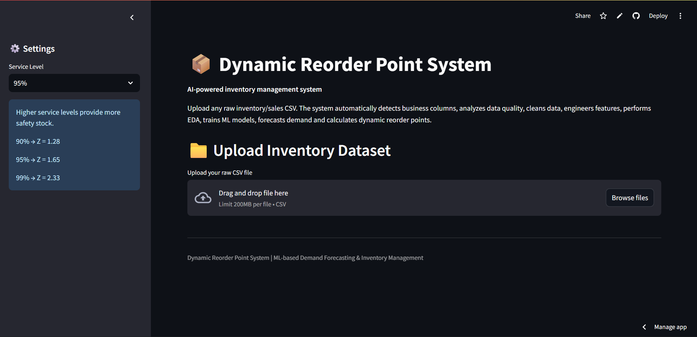
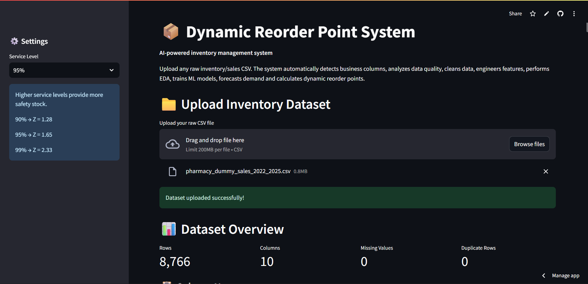
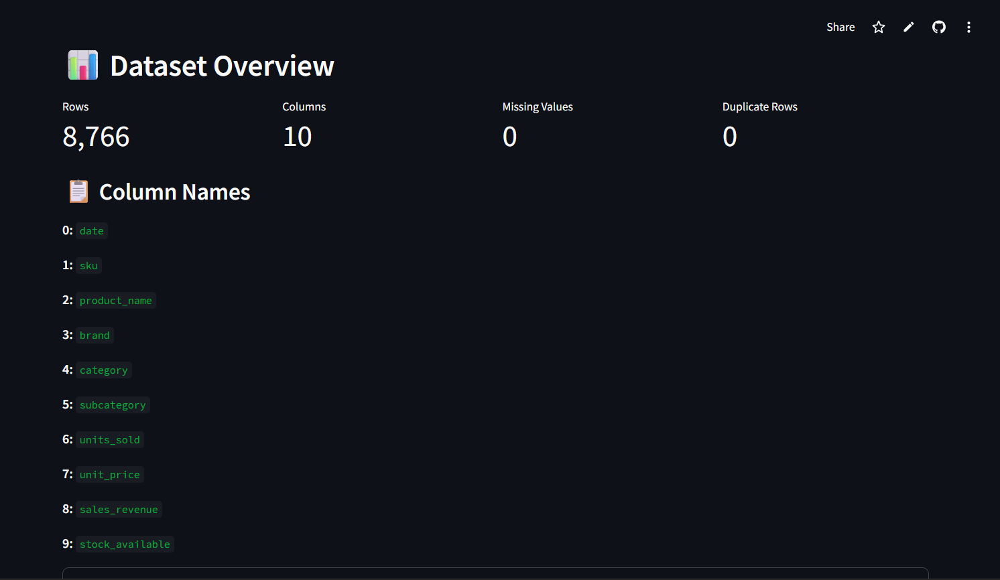

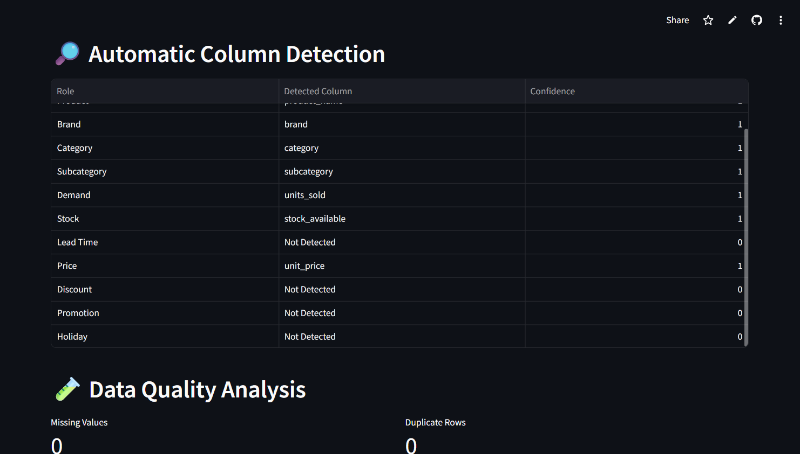
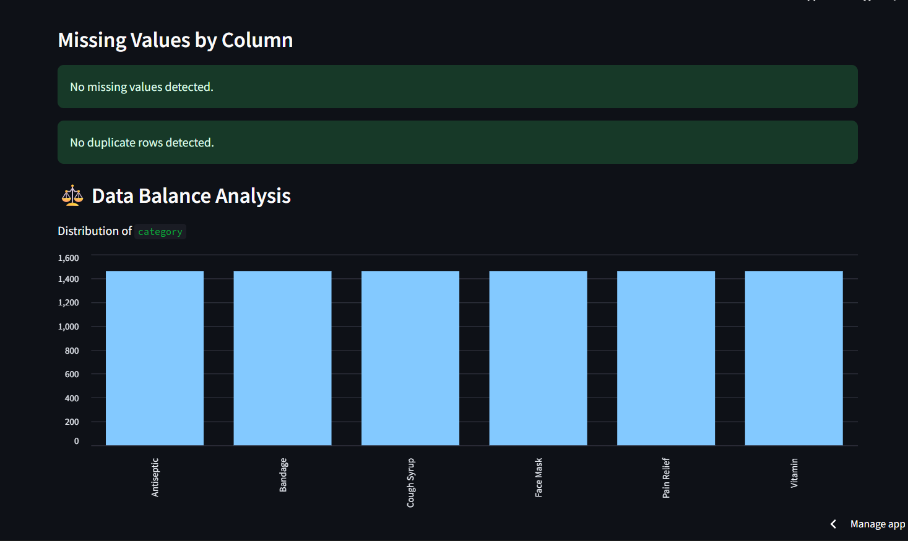
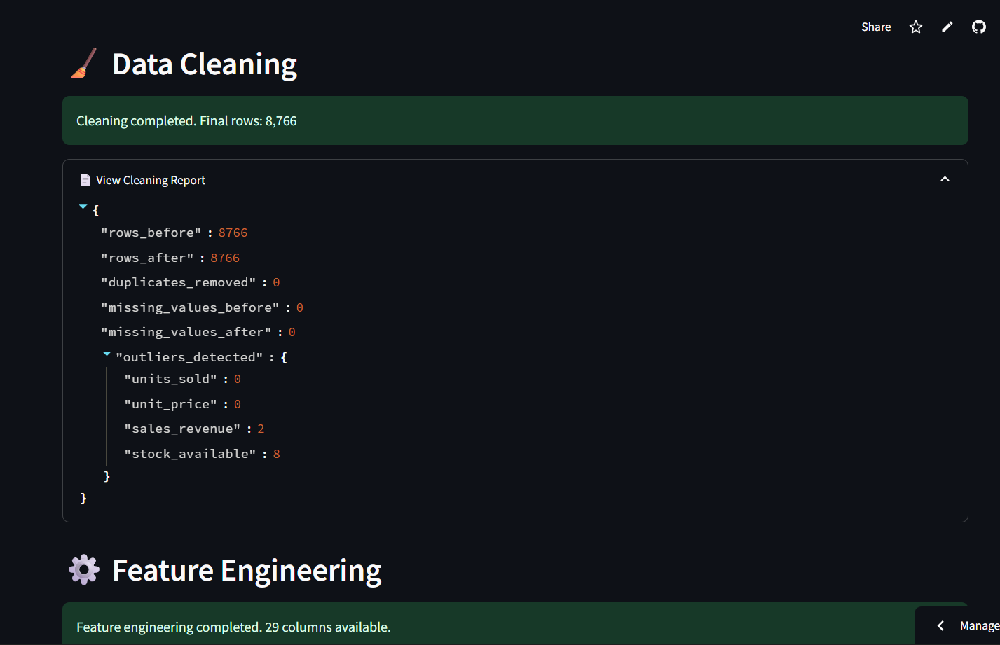
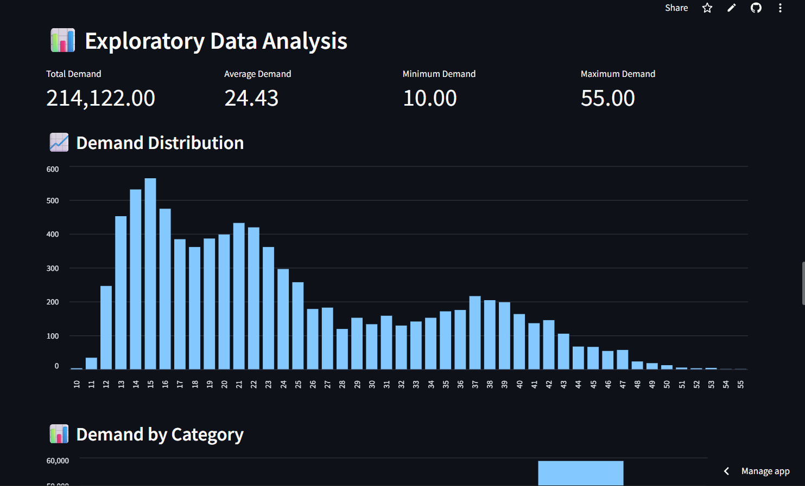
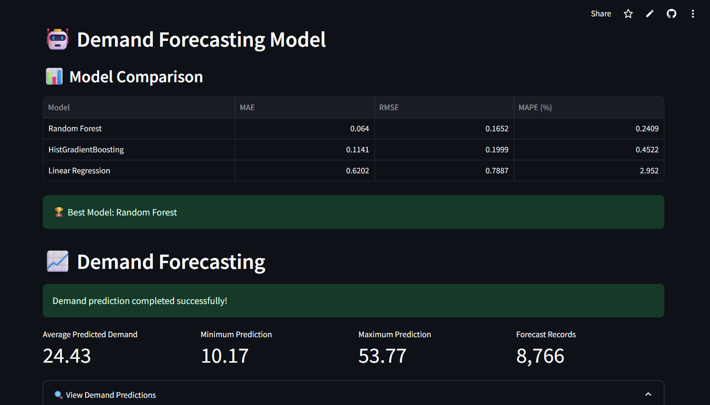
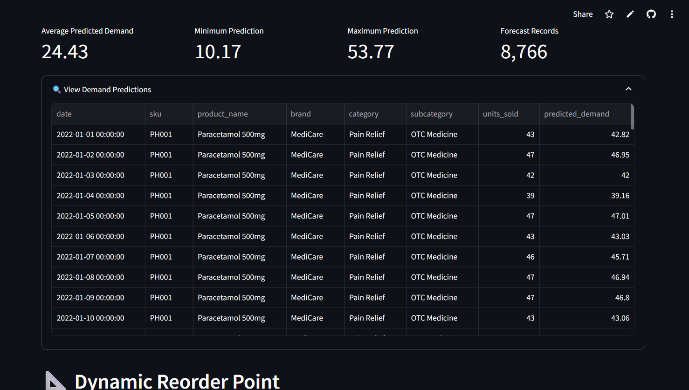
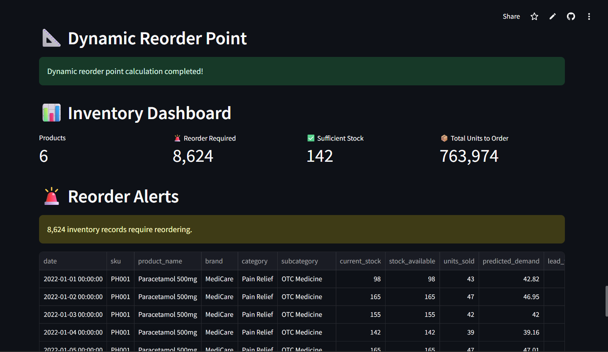
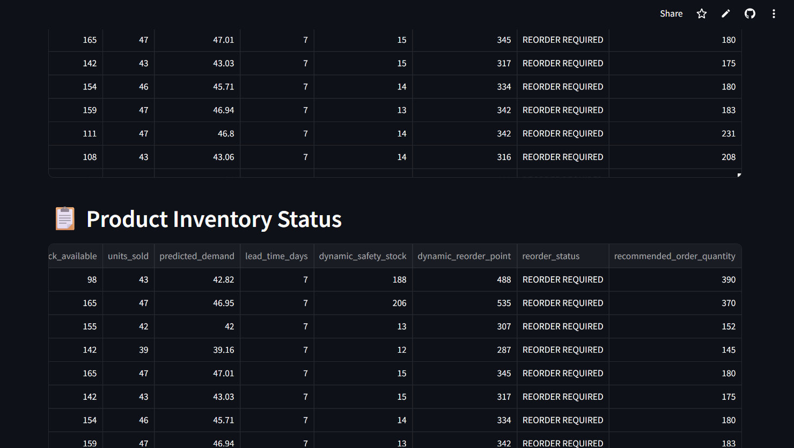
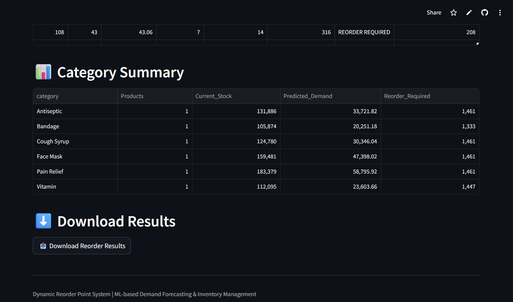


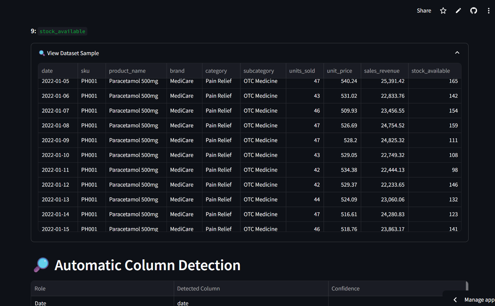
